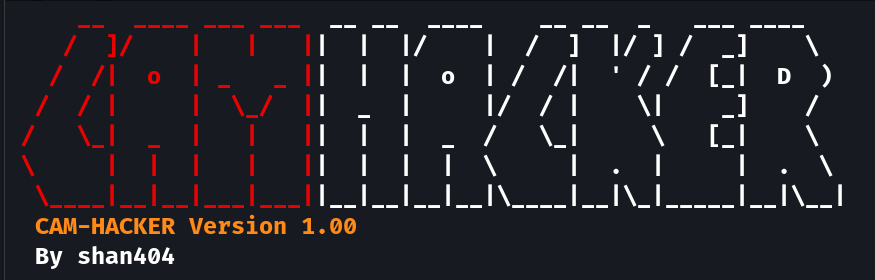

# Camhacker - Phishing Tool



## Introduction

Camhacker is a tool designed for educational purposes to demonstrate the potential risks associated with phishing attacks. This tool allows users to create phishing pages for various services and platforms, enabling them to capture sensitive information from unsuspecting targets.

**Disclaimer:** This tool is strictly for educational use only. The developer is not liable for any misuse of the tool. Users are solely responsible for their actions and must use the tool ethically and legally.

## Features

- Create phishing pages for popular services such as Jio, Google Pay, and Online Meetings.
- Utilizes Serveo.net for port forwarding, making it easier to deploy phishing pages.
- Customizable templates for different phishing scenarios.

## Installation

1. **Clone the repository:**
   ```bash
   git clone https://github.com/kksavad404/camhacker.git
   cd camhacker
3. **Run the script:**

   ```bash
   ./camhacker.sh
   ```

## Installing Ngrok on Kali Linux

1. **Download Ngrok:**
   - Visit the [Ngrok website](https://ngrok.com/download).
   - Download the Linux version of Ngrok.

2. **Extract the Ngrok Archive:**
   - Open a terminal.
   - Navigate to the directory where Ngrok is downloaded.
   - Run the following command to extract it:
     ```bash
     tar -xvzf /path/to/ngrok.tar.gz -C /usr/local/bin
     ```
   Replace `/path/to/ngrok.tar.gz` with the actual path to the Ngrok tarball.

3. **Set Permissions:**
   - Set the appropriate permissions for Ngrok:
     ```bash
     chmod +x /usr/local/bin/ngrok
     ```

4. **Verify Installation:**
   - To verify that Ngrok is installed correctly, run the following command:
     ```bash
     ngrok -v
     ```

5. **Obtain Ngrok Authentication Token:**
   - Sign up for a free account on the Ngrok website.
   - Obtain your authentication token from the dashboard.

6. **Authenticate Ngrok:**
   - Run the following command in your terminal, replacing `your_auth_token` with your actual Ngrok authentication token:
     ```bash
     ngrok authtoken your_auth_token
     ```

7. **Deploy Ngrok:**
   - Expose your local servers to the internet by running commands like:
     ```bash
     ngrok http 3333
     ```
   Replace `333` with the port number of your local server.

8. **Additional Notes:**
   - Keep Ngrok updated by checking for newer versions on the Ngrok website.
   - Keep your Ngrok authentication token secure.
   - Ngrok tunnels will remain active as long as your terminal session is running. Consider using tools like `screen` or `tmux` to keep Ngrok tunnels active even after closing the terminal.

That's it! You've successfully installed Ngrok, authenticated it, and deployed it to expose your local servers to the internet.


## Usage

1. Launch the script and choose the desired tunnel server option.
2. Select a template for the phishing page (e.g., Jio, Google Pay, or Online Meeting).
3. Once the phishing page is generated, share the provided link with the target.
4. Monitor for incoming connections and captured data.

## Dependencies

- PHP: Ensure PHP is installed on your system.

## Support

For any issues or suggestions, please open an issue.

## Contribution

Contributions are welcome! If you'd like to contribute to the project, please fork the repository, make your changes, and submit a pull request.
